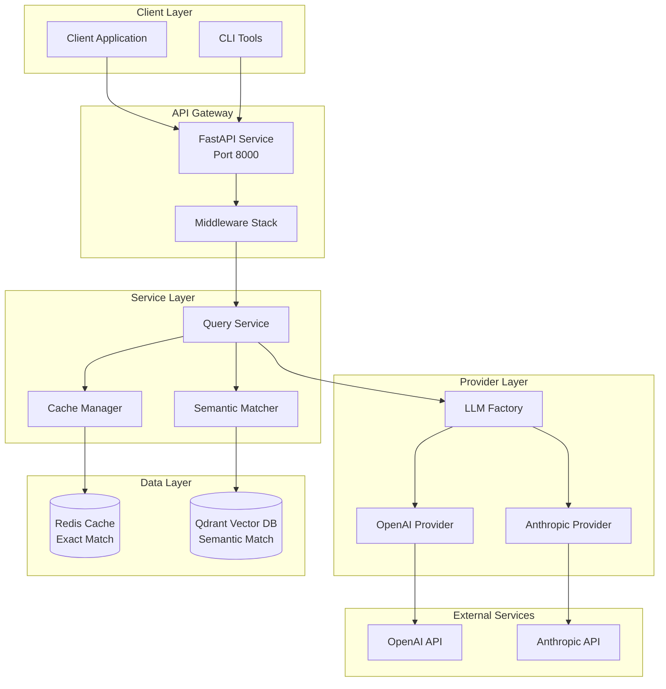
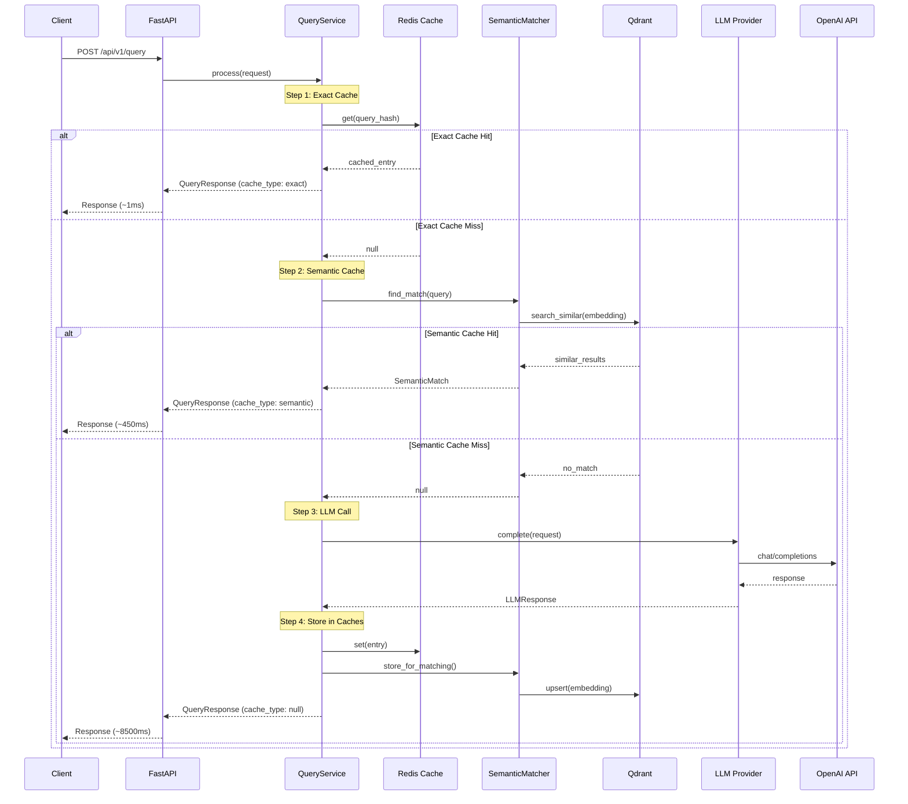
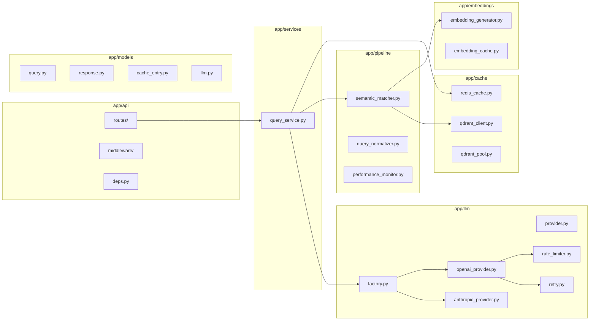
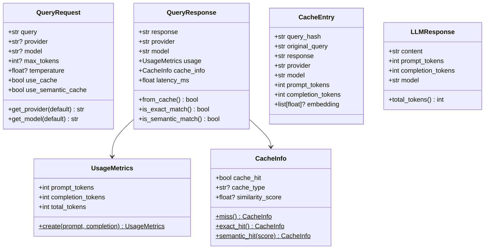
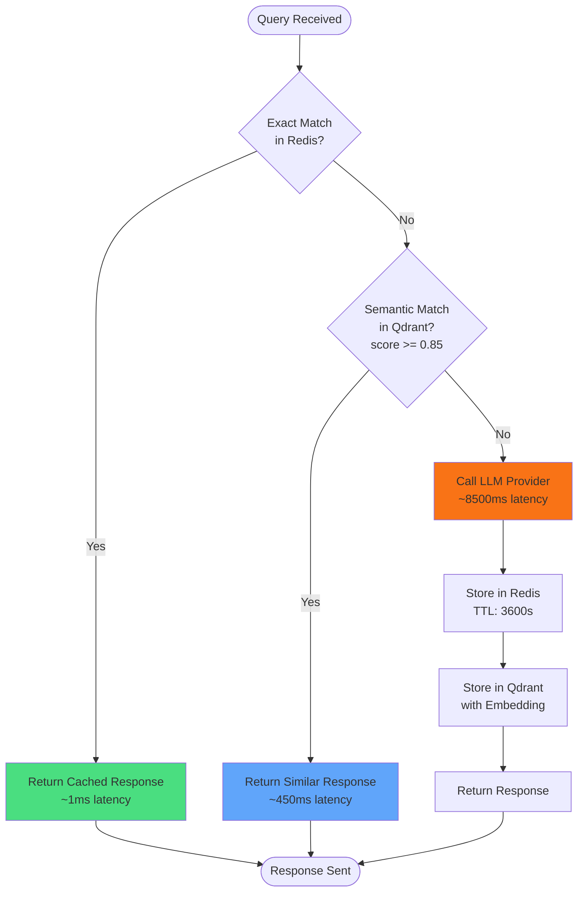
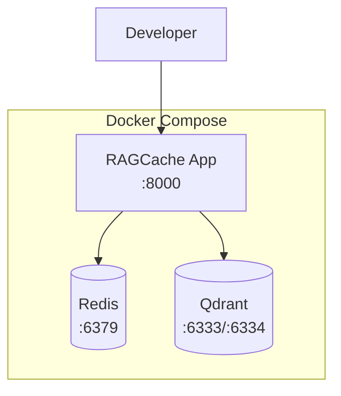
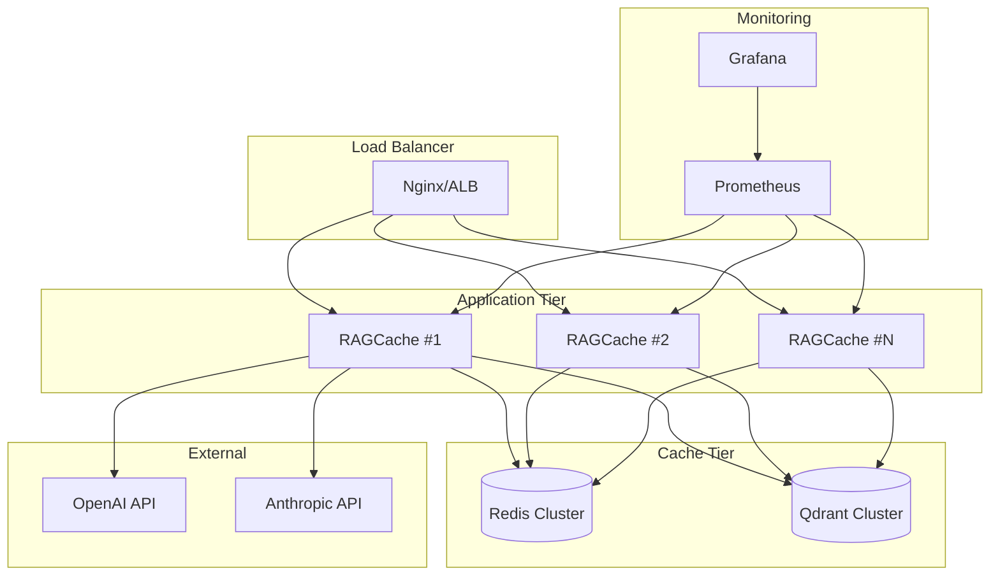
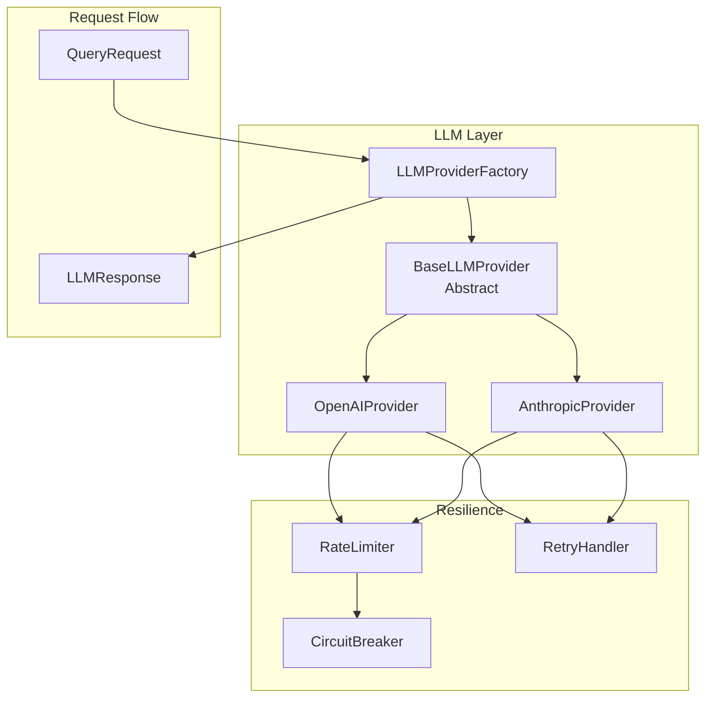
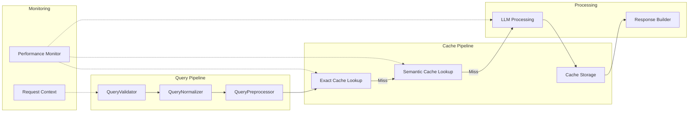
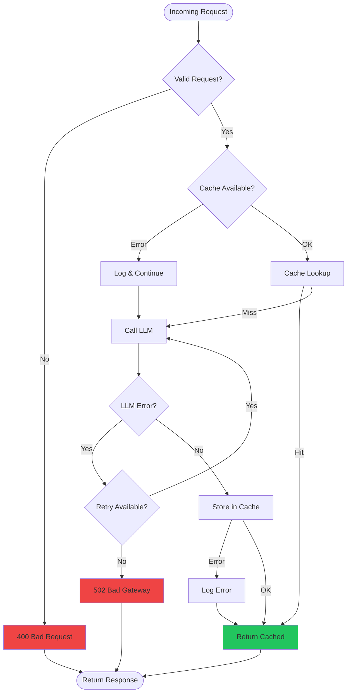

# RAG Cache Architecture Diagrams

This document contains visual representations of the RAG Cache system architecture using Mermaid diagrams.

## System Architecture Overview

## Query Processing Flow

## Component Architecture

## Data Models

## Cache Strategy

## Deployment Architecture

### Development Environment

### Production Environment

## LLM Provider Architecture

## Pipeline Components

## Error Handling Flow

---

## Related Documentation

- [API Documentation](API.md)
- [Architecture](ARCHITECTURE.md)
- [Deployment Guide](DEPLOYMENT.md)
- [Configuration](CONFIGURATION.md)
